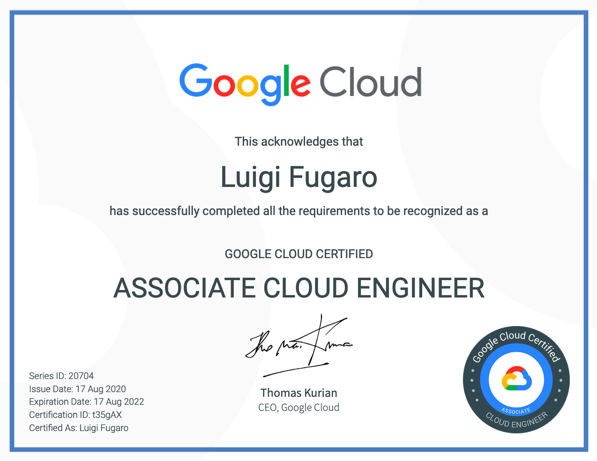
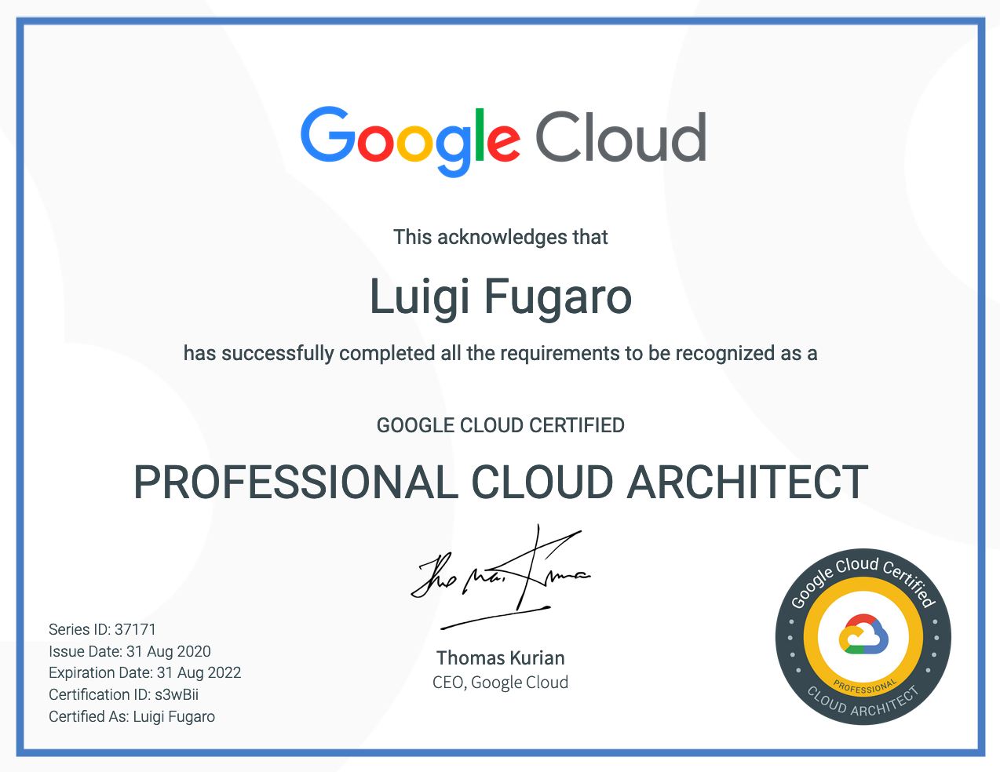

# My pandemic summer for the GCP certification journey (HTTP/1.1 /COVID 404 Not Found).

# Google Cloud Professional Cloud Architect notes
Here are my personal notes towards Google Cloud Professional Cloud Architect certification (aka PCA).

# DISCLAIMER

The following are personal notes that I wrote to track and remember how I prepared and what I studied.
There is no way that those notes can be useful for anyone else rather than me.
I'm just sharing. I'm not telling or suggesting you to study on those notes.
Also, all the content here must not be taken as a source of truth.
The only and original source of truth is the Google Cloud documentation site.

# Studying
Alright, here are my notes, but first let me tell you this.

I wanted the PCA certification.

I bought myself the Cloud Architecture with Google Cloud Professional Certificate specialization at Coursera (https://www.coursera.org/professional-certificates/gcp-cloud-architect), which is composed by 6 courses plus 1 for preparing the practice exam:
1. Google Cloud Platform Fundamentals: Core Infrastructure
1. Essential Google Cloud Infrastructure: Foundation
1. Essential Google Cloud Infrastructure: Core Services
1. Elastic Google Cloud Infrastructure: Scaling and Automation
1. Reliable Google Cloud Infrastructure: Design and Process
1. Preparing for the Google Cloud Professional Cloud Architect Exam

I also checked the Cloud Engineering with Google Cloud Professional Certificate specialization at Coursera (https://www.coursera.org/professional-certificates/cloud-engineering-gcp), which has the exactly the same courses except for course number 5, Reliable Google Cloud Infrastructure: Design and Process.

Just for reference:
1. Google Cloud Platform Fundamentals: Core Infrastructure
1. Essential Google Cloud Infrastructure: Foundation
1. Essential Google Cloud Infrastructure: Core Services
1. Elastic Google Cloud Infrastructure: Scaling and Automation
1. Preparing for the Google Cloud Associate Cloud Engineer Exam

So, what did I do?

For cost-saving, I did:
* I registered for the ACE exam with Google on Webassessor
* I kept on learning for the PCA;
* One week before the Online Proctored Exam, I enrolled for the ACE course, taking advantage of the "Free trial for 1 week".
 * Guess what???  Same videos and lectures, all green checked, so I just had to do the "Preparing for the Google Cloud Associate Cloud Engineer Exam" course.
* I prepared just for the ACE certification in that week . 
* I passed the exam (immediate feedback, but you need to wait the official email from Google, because they have to check the recording to see if you cheated somehow - I agree)

One thing to know about Google's feedback. It's just FAIL or PASS, no score, no explanation of what you did wrong.
So, the more you study and the more you feel confident with the technology, the better.

However, clearing the ACE exam gave me many more energies and enthusiasm to keep the focus on studying for the PCA.

If you feel like you need more practice exams, I strongly suggest you to use the ones provided by Whizlabs and Udemy.
Skills come with a price (money of free time).

I did it, for both ACE and PCA, and I went through all the practice tests, and two days before the planned exam (both ACE and PCA), I went through all of them once again to keep as much as possible Q&As in my short-term memory.
 It's not important if the questions are not exactly the same as the real exam ones, but it will give a sense on how to prepare for the exam.

## The exam

And during the exam I suggest to do:
* read the question once.
* re-read the question pausing at each interval (comma or dot), and check if that is a customer pain or a requirement.
* at every pause think about a technology you would use or that is involved.
* once re-read the question pausing, try to answer without reading the possible questions.
* check the questions, and find the ones that came up in your mind at first.
* if in doubt, go for exclusion.
* if still in doubt, stick with your best answer and mark it for review - you might find the answer following along with the other questions.

It's a 2 hours long exam, with 50 questions, and there is no break.

I have completed the PCA exam in an hour and ten minutes.
I used the rest of the time to review all my "mark for review" questions (at least 20) and changed a lot of them (but that's irrelevant, it was me, you may stick with your first answers).

Submit the exam and get your instant feedback.

Mine was
* Result: PASS

I have no idea about the minimum passing score. I read everywhere that it could be 80%, but I doubt, I think it's a bit less than 80%.
If it is 80% and you pass, hey we are extremely good!

# My very, very, very PERSONAL notes

Those are my notes that I wrote down during my exam preparation at that time (August 2020) to better remember concepts, components, features, integrations and so on. 

## Professional Cloud Architect

### Case study
Read them on the Google site on the exam guide page. It's better to remember and understand each single case in advance.

Which are:
* Mountkirk Games
* Dress4Win
* TerramEarth

### COMPUTE

* Compute Engine
  * Regional and Zonal
      * VMs type
          * Custom, Predefined
          * E2 General purpose
          * N2, N2D, N1 General purpose
          * M2, M1 Memory-Optimized
          * C2 Compute-Optimized
     * MIGs
          * max 1000 VMs
          * autohealing
          * load balancing (target pool or to a backend service)
          * autoscaling
          * auto-updating
          * stateful workloads.
     * UIGs
        * no autoscaling, autohealing, rolling update support, multi-zone support, or the use of instance templates
     * Persistent disks are zonal, so if you specify one you have to select the zone, then the VM will belong to that zone.
          * Local SSDs
          * Persistent SSDs
          * Persistent HDDs
          * List of PDs
              * Zonal standard PD
              * Regional standard PD
              * Zonal balanced PD
              * Regional balanced PD
              * Zonal SSD PD
              * Regional SSD PD
              * Local SSDs
              * Cloud Storage buckets
      * Billing
          * On-demand price
          * Preemptible price
          * 1 year commitment price
          * 3 year commitment price
      * Monitoring
          * Stackdriver
          * Serial Console

* App Engine
  * Regional
  * Standard (sandbox)
     * Startup in seconds
     * Runtimes
        * Python 2.7, Python 3.7, Python 3.8
        * Java 8, Java 11
        * Node.js 8, Node.js 10, and Node.js 12
        * PHP 5.5, PHP 7.2, PHP 7.3, and PHP 7.4 (beta)
        * Ruby 2.5, Ruby 2.6 (beta), and Ruby 2.7 (beta)
        * Go 1.11, Go 1.12, Go 1.13, and Go 1.14 (beta)
     * Pricing
        * 15 minutes minimum charge
        * instance hours (type of instance per hour)
  * Flexible (containers running on Compute Engine VMs)
     * Startup in minutes
     * Runtimes
        * Python
        * Java
        * Node.js
        * Go
        * Ruby
        * PHP
        * .NET
     * Compatible with processes and threads.
     * Pricing
        * 1 minute minimum charge
        * vCPU, memory, and persistent disks
  * Storage
     * Cloud Firestore in Datastore mode to store data in a NoSQL database
     * Cloud SQL for MySQL to store data in a MySQL database
     * Cloud SQL for PostgreSQL to store data in a PostgreSQL database
     * Cloud Storage to read
  * Traffic
     * Splitting
        * by Cookie
        * by IP address
  * Google Cloud APIs & Services
     * Cloud Storage, Cloud SQL, Memorystore, Tasks, Logging, Pub/Sub and others.
  * Security
     * HTTPS requests
     * Access control
     * App Engine firewall
     * Security scanner
  * Migration to GKE
     * gcloud builds submit --tag gcr.io/[YOUR-PROJECT-ID]/[YOUR-CONTAINER-NAME] .
  * Configuration files
     * app.yaml - runtime, environment, service, skip_files
        * liveness_check
        * readyness_check
        * networking
        * scaling
        * env vars
     * cron.yaml - scheduling jobs targeting app's URLs
     * dispatch.yaml - routing rules
     * index.yaml - to create index in Firestore in Datastore mode

* Kubernetes Engine
  * Regional, Zonal, Multi-zonal
     * Once created you cannot modify its location
  * Container Registry
     * Google Kubernetes Engine uses the service account configured on the VM instances of cluster nodes to push and pull images.
     * Required permissions
        * If the Google Kubernetes Engine cluster and the Container Registry storage bucket are in the same Google Cloud project, the Compute Engine default service account is configured with the appropriate permissions to push or pull images.
        * If the cluster is in a different project or if the VMs in the cluster use a different service account, you must grant the service account the appropriate permissions to access the storage bucket used by Container Registry.
        * By default, a Compute Engine VM has the read-only access scope configured for storage buckets. To push private Docker images, the VM instance must have the read-write storage access scope.
  * Networking
     * Container within a POD can communicate with one another
        * Local Network
        * Localhost
        * Shared Storage Volumes
  * Kubernetes Objects are used to represent the state of a Cluster.
  * Kubernetes Objects are persistent entities in the Kubernetes system.
  * kubectl describe node node-name | grep Allocatable -B 7 -A 6
  * Logging
     * Stackdriver
     * Event Logs
  * Types of Services
     * ClusterIP (default): Internal clients send requests to a stable internal IP address.
     * NodePort: Clients send requests to the IP address of a node on one or more nodePort values that are specified by the Service.
     * LoadBalancer: Clients send requests to the IP address of a network load balancer.
     * ExternalName: Internal clients use the DNS name of a Service as an alias for an external DNS name.
     * Headless: You can use a headless service in situations where you want a Pod grouping, but don't need a stable IP address.

* Cloud Functions
  * Name cannot be changed and must be unique within the region
  * Regional and the Region must be specified
  * Runtimes
     * Node.js 8 Runtime
     * Node.js 10 Runtime
     * Python Runtime
     * Go Runtime
     * Java Runtime
  * Calling functions
     * timeouts
        * default 60s
        * max 9m
  * Triggers
     * HTTP Triggers
     * Cloud Pub/Sub Triggers
     * Cloud Storage Triggers
     * Direct Triggers
     * Cloud Firestore
     * Analytics for Firebase
     * Firebase Realtime Database
     * Firebase Authentication
  * Integrations
     * Storage
        * Datastore
        * Firestore
        * Cloud Storage
  * Pricing
     * 100ms
     * Free
        * Networking
        * Outbound Data per month  5GB
        * Inbound Data (Ingress)
        * Outbound Data to Google APIs in the same region

### STORAGE

* Transferring from another cloud storage provider
  * Use Storage Transfer Service
* Transferring less than 1 TB from on-premises
  * Use gsutil
* Transferring more than 1 TB from on-premises
  * Use Transfer service for on-premises data

* Local HDD
* Local SSD
  * You can't use customer-supplied encryption keys
  * Storage isn't automatically replicated and all data on the local SSD might be lost
  * You cannot use your own keys with local SSDs because local SSDs do not persist beyond the life of a virtual machine. Local SSDs are already protected with an ephemeral encryption key that Google does not retain.
  * Min/Max/PerInstance
     * 375GB/375GB/9TB

* Persistent HDD
* Persistent SSD
  * Zonal, Regional
     * synchronous replication
  * Min/Max/PerInstance
     * 10GB/64TB/257TB
  * Attach to virtual machine instances running in Compute Engine or Google Kubernetes Engine
  * Transparently resize, quickly back up, and support simultaneous readers
  * You can only encrypt new persistent disks with your own key. You cannot encrypt existing persistent disks with your own key.
  * Persistent Disks are automatically encrypted to protect your data, in transit or at rest. You can supply your own key, or we will automatically generate one for you.

* Compute Engine does not store encryption keys with instance templates, so you need to store your own keys in KMS to encrypt disks in a managed instance group.

* Filestore
  * Fully managed network attached storage (NAS) for Compute Engine and GKE instances
  * Predictable price for performance
  * Scales to 100s of TBs for high-performance workloads
  * Filestore supports capacity up to 320 TB and throughput of 16 GB/s and 480K IOPS
  * Full NFSv3 support 100s of TBs of capacity

* Drive Share is like MS SharePoint

* Cloud Storage
  * Bucket globally unique names
  * Location
     * Region, Multi-Region, Dual-Region
     * Storage as an External Datasource must be in the same location selected for the service
  * You upload Object
  * Object is immutable
  * No limit for the numbers of object a bucket can contain
  * Metadata is K/V pair
  * Max object size is 5TB
  * Max bucket size is unlimited
  * First-byte Latency in milliseconds
  * SLA
     * 99.9% Nearline. Coldline, Archive in Region
     * 99.95% Nearline. Coldline, Archive in Dual-Region or Multi-Region
     * 99.99%  Standard in Region
     * \>99.99%  Standard in Dual-Region or Multi-Region
  * Uploading
     * With Internet
        * Google Cloud Console
        * Cloud SDK/gsutil
        * Cloud FUsE
     * Without Internet
        * Offline Media Import
        * Cloud Transfer Appliance
  * CSEKs (Customer Supplied Encryption Keys)
  * Quotas
     * Bucket
        * There is a per-project rate limit to bucket creation and deletion of approximately 1 request every 2 seconds
        * There is an update limit on each bucket of once per second, so rapid updates to a single bucket (for example, changing the CORS configuration) won’t scale.
        * There is a limit of 100 members holding legacy IAM roles per bucket. Examples of members include individual users, groups, and domains.
        * Pub/Sub
           * The bucket can have up to 100 total notification configurations.
           * The bucket can have up to 10 notification configurations set to trigger for a specific event.
           * Each notification configuration can have up to 10 custom attributes.
     * Object
        * There is a maximum size limit of 5 TB for individual objects stored in Cloud Storage.
        * There is an update limit on each object of once per second, so rapid writes to a single object won’t scale.
        * There is no limit to writes across multiple objects, which includes uploading, updating, and deleting objects. Buckets initially support roughly 1000 writes per second and then scale as needed.
        * There is no limit to reads of objects in a bucket, which includes reading object data, reading object metadata, and listing objects. Buckets initially support roughly 5000 object reads per second and then scale as needed.
        * There is a limit of 100 access control list entries (ACLs) per object. Members can be individual users, groups, or domains.
  * Versioning
     * Current and versioned object have same price
     * Disable will not delete any data, you will just not have noncurrent metadata anymore
  * Object Lifecycle Management (OLM)
     * Delete
     * SetStorageClass
     * Rules
        * Age
        * CreatedBefore
        * IsLive
        * MatchesStorageClass
        * NumberOfNewerVersions

### NETWORKING

* VPC
  * Global, no restriction on where the resources are located
  * Firewall rules and Network tags
  * VPC Network Peering allows to connect 2 VPC using internal IP address

  * Subnet
     * Regional
     * Within a VPC network, all primary and secondary IP ranges must be unique, but they do not need to be contiguous.
     * You cannot change the name or region of a subnet after you have created it.
     * The minimum primary or secondary range size is eight IP addresses. In other words, the longest subnet mask you can use is /29.
     * Avoid using IP addresses from the 10.128.0.0/9 block for a subnet's primary or secondary IP ranges

* Shared VPC
  * To support multiple projects within an organization.
  * A Shared VPC network is a VPC network defined in a host project and made available as a centrally shared network for eligible resources in service projects.

* VPN
  * Secure Tunnel
  * Cloud VPN uses a Maximum Transmission Unit (MTU) of 1460 bytes
  * Dynamic and static Routing
  * Maximum throughput per Secure Tunnel is 3Gbps
  * Bandwidth can be increased with multiple tunnels

* Hybrid connectivity
  * Interconnect is the recommended method to access GCP Resources
  * Peering can be used in combination with a GCP VPN.
  * Interconnect can NOT be used in combination with a GCP VPN.
  * To obtain Egress Rate discounts, those must be enabled per Project.

* Direct Peering
  * Available in more than 100 locations in 33 countries around the world.
  * Exchange high-throughput cloud traffic and direct path from your on-premises network to Google services.
  * Direct Peering can be implemented for G Suite Enterprise Services without creating a GCP account

* Carrier Peering
  * Exists outside of Google Cloud. Instead of Carrier Peering, the recommended methods of access to Google Cloud are Partner Interconnect, which uses a service provider, or Dedicated Interconnect, which provides a direct connection to Google.

* Dedicated Interconnect
  * Provides a high-throughput connection between On-Prem networks and Google's Edge Network with over 10Gbps of bandwidth
  * You're charged on a monthly basis for interconnects and on an hourly basis for interconnect attachments (VLANs).
  * Provides a strict SLA that will pay out Financial Credits if the SLA is not met.

* Partner Interconnect
  * Provides a high-throughput connection between On-Prem networks and Google's Edge Network with less than 10Gbps of bandwidth.
  * Google charges you on a monthly basis for interconnect attachments (VLANs), depending on their capacity.
  * Provides a strict SLA that will pay out Financial Credits if the SLA is not met.
  * Allows organizations whose data centers are geographically distant from a Google Cloud region or Point of Presence (POP) to connect to GCP, using our partners connections.

* Cloud Load Balancer
  * You can apply Cloud Load Balancing to all of your traffic: HTTP(S), TCP/SSL, and UDP.
  * Target Pools and Backend Services provide the ability to distribute traffic to VMs within a Compute Engine Instance Group.
  * Cloud Load Balancer are compatible with both IPv4 and IPv6

  * Global HTTPS
     * Session Affinity
     * cookie-based Session Affinity
     * Cloud Armor to prevent DDoS attacks
     * Cloud CDN
  * Global SSL Proxy
     * Session Affinity
     * Listens only on specific ports
  * Global TCP Proxy
     * Session Affinity
     * Listens only on specific ports
  * Network LB
     * Session Affinity
     * Only UDP, TCP, and SSL traffic
     * Regional availability and can be used for Traffic which is external to a GCP VPN and is non-proxied
  * Internal LB
     * Session Affinity
     * Only for traffic within a GCP VPC Network
     * It's architected using Andromeda,
  * External LB

* Cloud DNS provides
  * 100% availability
  * DNS Peering
  * Authoritative DNS Lookup
  * DNS Forwarding
  * DNS Zone Management
  * Automatic scaling
  * To monitor with Stackdriver

* Cloud Router
  * BGP

* Cloud NAT
  * allow GCP Resources without an external IP address to access the Internet

### DATA and ANALYTICS

* Cloud Datastore - Firestore in Datastore
  * Multi-region
  * Multi-zone
  * Free Daily Quota based on Storage Size and on the amount of Reads, Writes, and Deletes
  * Components
     * Kind, Entity, Property, Key
  * Query
     * Strongly consistent queries guarantee the freshest results, but may take longer to complete.
     * Eventually consistent queries generally run faster, but may occasionally return stale results.
  * SLAs
     * Datastore Multi-Region   >= 99.95%
     * Datastore Regional   >= 99.9%
  * HBase File System

* Firestore
  * It's the next generation fo Datastore
  * Components
     * Collection group
     * Document
     * Field
     * Document ID

* Cloud Bigtable
  * Based on Apache HBase
  * Instances, clusters, and nodes
     * A Cloud Bigtable instance is a container for your data.
     * Instances have one or more clusters, located in different zones.
     * Each cluster has at least 1 node.
     * A table belongs to an instance, not to a cluster or node.
     * You can choose which cluster your applications connect to, or you can let Cloud Bigtable balance traffic between clusters.
     * Each cluster is located in a single zone. An instance's clusters must each be in unique zones
  * Storage Type
     * Permanent decision
     * SSD or HDD
        * Every cluster in your instance must use the same type of storage
  * Consistency
     * eventually consistent - default
     * strong consistency
  * Interface
     * Cloud Console, gloud, cbt
  * Integrations
     * BigQuery
     * Cloud Functions
     * Dataflow
     * Dataproc
     * Cloud Data Fusion
     * Apache Spark Streaming
     * Hadoop
     * Apache Storm
  * Cluster
     * Up to 4 clusters per instance.
        * More 2 clusters per instance, replication is enabled
     * Up to 30 node per zone per project, more nodes you need to issue a request to support
  * Use Cases
     * Petabyte volumes
     * Storage engine for batch MapReduce operations, stream processing/analytics, and machine-learning applications
     * Unstructured data - Key/Value pair
     * Time-series data, such as CPU and memory usage over time for multiple servers.
     * Marketing data, such as purchase histories and customer preferences.
     * Financial data, such as transaction histories, stock prices, and currency exchange rates.
     * Internet of Things data, such as usage reports from energy meters and home appliances.
     * Graph data, such as information about how users are connected to one another.
     * Google Search, Analytics, Maps, and Gmail
  * Updates without downtime
     * The number of nodes in each cluster
     * The number of clusters in the instance
     * The application profiles for the instance
     * The labels for the instance
     * The display name for the instance
     * Upgrade a development instance to a production instance

* Cloud SQL
  * Relational databases
     * MySQL, PostgreSQL, SQL Server
  * Location
     * Multi-region, region, zones
  * MySQL
     * Support replication from an external master or external replicas
     * Read replicas and failover replicas are charged at the same rate as stand-alone instances.
  * HA (High Availability) Clusters in Cloud SQL can be referred to as Regional Instances and data is synchronously replicated across multiple zones
  * Backups
     * On-demand backups
     * Automated backups

* Cloud Spanner
  * Regional (with 3 replicas), Multi-regional
  * Global Transactional Consistency
     * Cloud Spanner scales horizontally and serves data with low latency while maintaining transactional consistency
  * After you create an instance, you cannot change the configuration of that instance later.
  * ACID transactions with global strong consistency
  * SLA
     * 99.99% Regional
     * 99.999% Multi-regional
  * Petabytes

* BigQuery
  * Analytics, DWH
  * Regional, Multi-regional
  * Partitioning
     * Increase performance using vertical or horizontal partitioning
     * Partition BigQuery tables by:
        * Ingestion time: Tables are partitioned based on the data's ingestion (load) time or arrival time.
        * Date/timestamp: Tables are partitioned based on a TIMESTAMP or DATE column.
        * Integer range: Tables are partitioned based on an integer column.
     * Partitioning will automatically create separate Columns for Null and Unpartitioned data for
        * Date/timestamp partitioning
        * Integer range partitioning
  * Integrations
     * Read
        * CSV and JSON from Cloud Storage
        * Map Reduce, Spark, Dataproc
     * Write
        * Dataflow can stream data at 100k rows/s
     * Tools
  * Pricing
     * Charging per second interval
     * Flat-rate pricing can use the BigQuery Storage API to read up to 300 TB of data per month at no charge

* Dataproc
  * Automated cluster management
  * Build fully managed Apache Spark, Apache Hadoop, Presto, and other OSS clusters
  * After creating a Dataproc cluster, you can adjust ("scale") the cluster by increasing or decreasing the number of primary or secondary worker nodes in the cluster. You can scale a Dataproc cluster at any time, even when jobs are running on the cluster.
  * Integration
     * Cloud Storage
     * Cloud BigQuery
     * Cloud Bigtable
  * Billing
     * per second
     * minimum 1 minute
     * Preemptible secondary VMs can be used to lower the price.
  * SLA
     * \>=99.5%

* Dataprep
  * An intelligent cloud data service to visually explore, clean, and prepare data for analysis and machine learning.
  * Automatically detects schemas, data types, possible joins, and anomalies such as missing values, outliers, and duplicates so you get to skip the time-consuming work of assessing your data quality and go right to the exploration and analysis.
  * Integrations
     * Cloud Dataflow
     * BigQuery and Cloud Storage towards Dataprep towards Dataflow towards BigQuery and Cloud Storage

* Cloud Data Fusion
  * Visual point-and-click interface enabling code-free deployment of ETL/ELT data pipelines
  * Broad library of 150+ preconfigured connectors and transformations, at no additional cost
  * Natively integrated best-in-class Google Cloud services
  * End-to-end data lineage for root cause and impact analysis
  * Built with an open source core (CDAP) for pipeline portability

* Dataflow
  * fully managed ETL/ELT service for transforming, transporting, and enriching data
  * Unified stream and batch data processing that's serverless, fast, and cost-effective
  * Fully managed data processing service
  * Automated provisioning and management of processing resources
  * Horizontal autoscaling of worker resources to maximize resource utilization
  * OSS community-driven innovation with Apache Beam SDK
  * Reliable and consistent exactly-once processing
  * Ready-to-use real-time AI patterns
  * Provides for both streaming and batch pipelines

* Datalab
  * Data exploration tool which provides an intuitive notebook format to combine code, results, and visualizations
  * An easy-to-use interactive tool for data exploration, analysis, visualization, and machine learning.
  * Use Cloud Datalab to gain insight from your data. Interactively explore, transform, analyze, and visualize your data using BigQuery, Cloud Storage, and Python.

* Data Catalog
  * Provides Organizations with a central location to discover, manage, and understand all their data in the Google Cloud

* Cloud Data Studio
  * Analogy with Power BI and Tableau
  * Report and Dashboard generation

  * Many pre built connectors for data sources such as Cloud SQL, BigQuery, and MySQL

### DEV

* Cloud Pub/Sub is a fully-managed real-time messaging service that allows you to send and receive messages between independent applications.
  * Topic: A named resource to which messages are sent by publishers.
  * Subscription: A named resource representing the stream of messages from a single, specific topic, to be delivered to the subscribing application. For more details about subscriptions and message delivery semantics, see the Subscriber Guide.
  * Message: The combination of data and (optional) attributes that a publisher sends to a topic and is eventually delivered to subscribers.
  * Message attribute: A key-value pair that a publisher can define for a message. For example, key iana.org/language_tag and value en could be added to messages to mark them as readable by an English-speaking subscriber.
  * Use cases
     * Balancing workloads in network clusters. For example, a large queue of tasks can be efficiently distributed among multiple workers, such as Google Compute Engine instances.
     * Implementing asynchronous workflows. For example, an order processing application can place an order on a topic, from which it can be processed by one or more workers.
     * Distributing event notifications. For example, a service that accepts user signups can send notifications whenever a new user registers, and downstream services can subscribe to receive notifications of the event.
     * Refreshing distributed caches. For example, an application can publish invalidation events to update the IDs of objects that have changed.
     * Logging to multiple systems. For example, a Google Compute Engine instance can write logs to the monitoring system, to a database for later querying, and so on.
     * Data streaming from various processes or devices. For example, a residential sensor can stream data to backend servers hosted in the cloud.
     * Reliability improvement. For example, a single-zone Compute Engine service can operate in additional zones by subscribing to a common topic, to recover from failures in a zone or region.
  * Integrations
     * In
        * Cloud Logs
        * Cloud API
        * Cloud Dataflow
        * Cloud Storage
        * Compute Engine
     * Out
        * Cloud Networking
        * Compute Engine
        * Cloud Dataflow
        * App Engine
        * Cloud Monitoring

* Cloud Endpoints
  * Provides API Management by using either Frameworks for App Engine, OAS (OpenAPI Specification), or gRPC
  * User authentication - JSON Web Token validation and a streamlined developer experience for Firebase Authentication, Google Auth, and Auth0.
  * API keys - Generate API keys in Google Cloud Console and validate on every API call. Share your API with other developers to allow them to generate their own keys.
  * Automated deployment - With App Engine, the proxy is deployed automatically with your application. On Google Kubernetes Engine or Compute Engine, use our containerized ESP for simple deployment.
  * Logging and monitoring - Monitor traffic, error rates, and latency, and review logs in Cloud Logging. Use Cloud Trace to dive into performance and BigQuery for analysis.

* Apigee
  * Provides the ability to Design, Secure, Publish, Analyze, Monitor, and Monetize APIs?
     * Design APIs
     * Secure APIs
     * Publish APIs
     * Analyze APIs
     * Monitor APIs
     * Monetize APIs
     * Developer portal
     * Manage microservices
     * Apigee hybrid

* Cloud Healthcare API
  * Accelerate your healthcare solution development with fully managed, enterprise-scale, HL7® FHIR®, HL7® v2, and DICOM® APIs. Help protect your healthcare data while meeting industry-specific security, privacy, and compliance requirements.

* Cloud Composer
  * A fully managed workflow orchestration service built on Apache Airflow.
  * Author, schedule, and monitor pipelines that span across hybrid and multi-cloud environments
  * Built on the Apache Airflow open source project and operated using Python
  * Built-in integration with BigQuery, Dataflow, Dataproc, Datastore, Cloud Storage, Pub/Sub, AI Platform, and more, giving you the ability to orchestrate end-to-end Google Cloud workloads.

* Cloud Memorystore
  * Reduce latency with scalable, secure, and highly available in-memory service for Redis and Memcached.
  * Build application caches that provide sub-millisecond data access
  * 100% compatible with open source Redis and Memcached
  * Standard Tier Memorystore for Redis instances provide a 99.9% availability SLA with automatic failover to ensure that your instance is highly available. You also get the same availability SLA for Memcached instances.

* Cloud Repository
  * Used for Code Version Control

* Cloud Build
  * Provides continuous build capabilities
  * Spinnaker can be integrated with Cloud Build to provide a complete CI/CD pipeline.

* Cloud Code
  * Provides everything you need to write, debug, and deploy Kubernetes applications

* Container Registry
  * Provides the ability to store, manage, and secure Docker container images

### AI

* Natural Language uses machine learning to reveal the structure and meaning of text.
  * You can extract information about people, places, and events, and better understand social media sentiment and customer conversations.
  * Natural Language enables you to analyze text and also integrate it with your document storage on Cloud Storage.
  * Train your own high-quality machine learning custom models to classify, extract, and detect sentiment with minimum effort and machine learning expertise using AutoML Natural Language.
  * You can use the AutoML Natural Language UI to upload your training data and then test your custom model.
  * Use AutoML Natural Language to extract information from a range of content, such as collections of articles, scanned PDFs, or previously archived records.
  * For each token in the text, the Natural Language provides information about its internal structure (morphology) and its role in the sentence (syntax).
* Translation
  * Automatically determine the language of a writing sample and then perform a translation
* Video AI
   * Has the ability to make video content easily searchable and discoverable
* TensorFlow
  * open-source software library can be used to construct Neural Networks
* Cloud TPU
  * Provides a custom-designed family of ASIC (Application-Specific Integrated Circuit) hardware accelerators, which are specifically for machine learning
  * Preemptible Cloud TPU
* ML Engine (AI Platform)
  * can be deployed to provide Online Predictions or Batch Predictions
* Vision AI
  * Provides the ability to train custom image models with an easy-to-use graphical interface
  * Provides the ability to detect emotion and understand text using pre-trained models
* Speech-to-Text
   * Can transcribe audio to text for more than 80 languages

